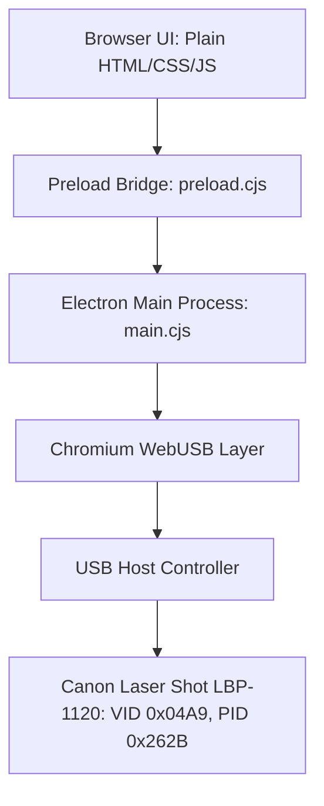
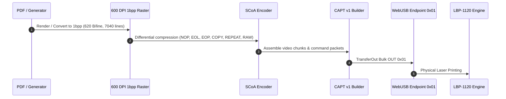
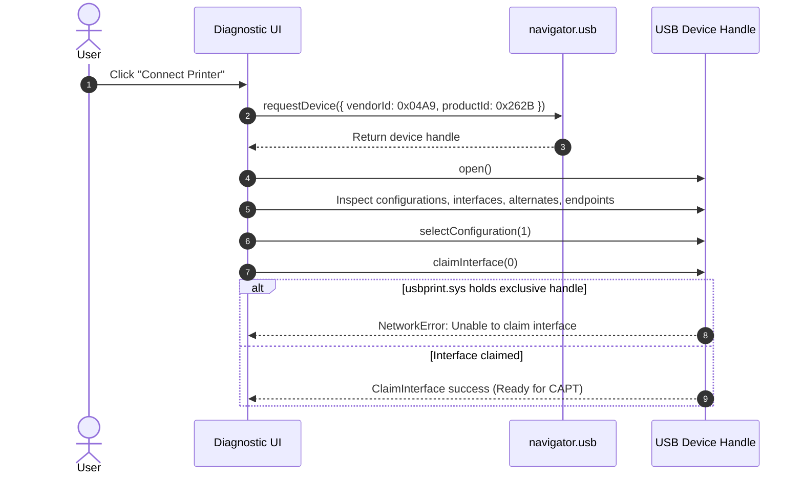
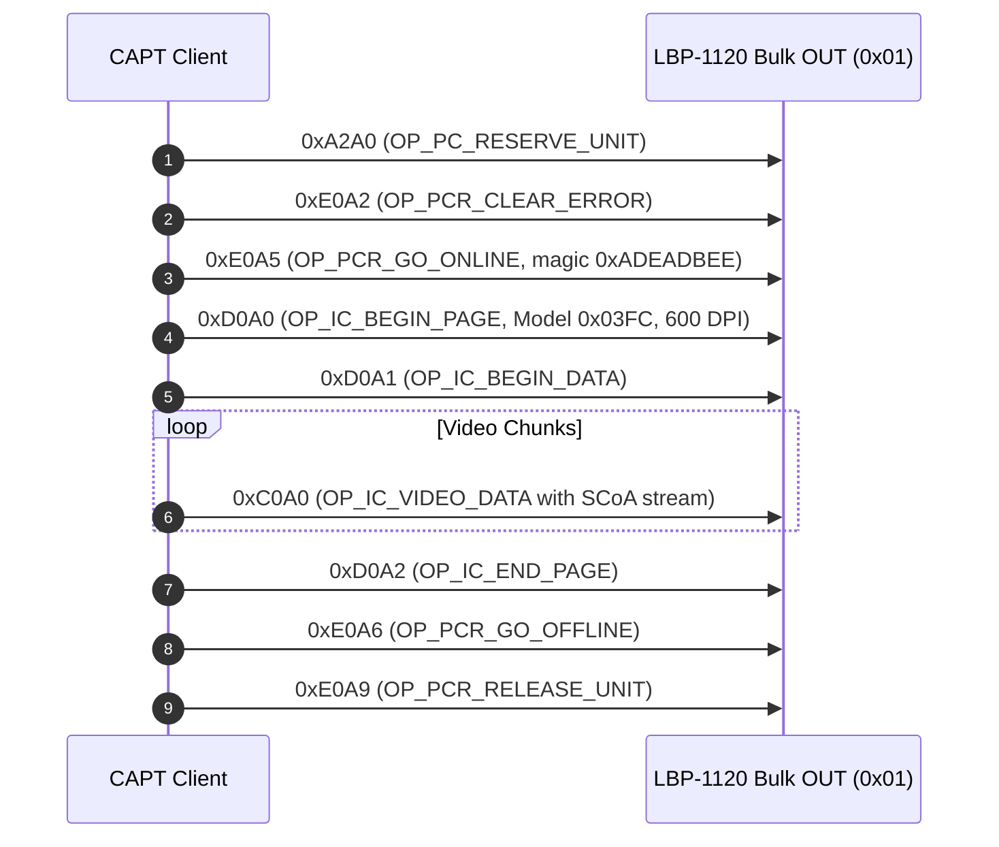

# Canon Laser Shot LBP-1120 Direct WebUSB & SCoA Engine

> **IMPORTANT DISCLAIMER:**
> **This is NOT a Windows printer driver.**
> It does not register a Windows print queue, does not create or install a `.inf` or kernel driver, does not use Zadig, does not replace the Windows in-box printer-class driver with WinUSB, does not require Linux, CUPS, or WSL, and does not require the proprietary Canon driver to be installed.

---

## 1. System & Architecture Overview



### Complete Print Sequence:


### USB Connection & Diagnostic Sequence:


### CAPT Print Sequence:


---

## 2. Technical Specifications

- **Target Runtime:** Electron 22.x (Chromium 108) — *Final Electron major version supporting Windows 7, 8, and 8.1, as well as Windows 10 and 11*.
- **Hardware Supported:** Canon LASER SHOT LBP-1120
  - **Vendor ID (VID):** `0x04A9`
  - **Product ID (PID):** `0x262B`
  - **Target Model Code:** `0x03FC`
  - **Interface:** Interface 0 (USB Class `0x07` Printer, Subclass `1`, Protocol `2` Bi-directional)
  - **Bulk OUT Endpoint:** `0x01` (64 bytes max packet)
  - **Bulk IN Endpoint:** `0x82` (64 bytes max packet)
- **UI Stack:** Vanilla HTML5 + CSS + JavaScript (Zero React, Vue, Angular, Tailwind, or Bootstrap).

---

## 3. How to Build & Run Locally

### Prerequisites
- Node.js `18.x` (or `20.x`)
- npm `9.x` or later

### Install Dependencies
```bash
npm install
```

### Run Automated Unit & Protocol Tests (Hardware-Free)
```bash
npm test
```

### Launch in Electron 22 Desktop
```bash
npm run electron
```

### Run Local Development Server
```bash
npm run dev
```

---

## 4. How to Download the Windows Executable from GitHub Actions

1. Open this repository on GitHub.
2. Click the **Actions** tab in the top navigation bar.
3. Select the latest run of the **"Windows Build & Test (Electron 22)"** workflow.
4. Scroll down to the **Artifacts** section at the bottom of the summary page.
5. Click **`LBP1120-Windows-x64`** to download the ZIP package.
6. Extract the downloaded `LBP1120-Windows-x64-v1.0.0-portable.zip` file on any Windows 7, 8, 8.1, 10, or 11 (64-bit) computer.
7. Double-click `LBP1120-Windows-x64.exe` to run. **No Node.js installation is required on the target machine.**

---

## 5. How to Use

1. Connect the Canon LBP-1120 via USB cable and turn the power on.
2. Launch the application.
3. Click **"1. Connect Printer (WebUSB)"**:
   - The app opens the device, enumerates configuration and interface descriptors, and attempts to claim Interface 0.
   - All descriptors and inspected endpoints (`0x01` OUT, `0x82` IN) will appear in the **USB Information Area**.
4. Test without hardware:
   - Click **"Run Simulated Protocol Test"** to verify the full 10-phase CAPT sequence through a simulated transport.
5. Click **"Render 600 DPI Test Page"** to render a 1bpp geometric test page.
6. Click **"Dry Run (Verify SCoA Bytecode)"** to verify real-time SCoA compression.
7. Click **"Print to LBP-1120 via USB"** to dispatch the job over physical USB (active once Interface 0 is claimed).

---

## 6. Known Limitations & Technical Realities on Windows

1. **Windows `usbprint.sys` Driver Ownership:**
   - Under standard Windows 10/11 default installations, Windows automatically binds `usbprint.sys` to Interface 0.
   - Because `usbprint.sys` holds an exclusive kernel handle, Chromium's WebUSB implementation (`winusb.sys`) may return `NetworkError: Unable to claim interface`.
   - In keeping with strict non-invasive requirements, this software does **not** replace drivers via Zadig or modify system drivers.
2. **Physical Laser Engine Warmup:**
   - The Canon LBP-1120 is an early CAPT v1 host-based printer. Sending print data requires proper engine readiness (`0xE0A0` status poll).

---

## 7. Safety & Security Notes

- WebUSB calls are restricted to VID `0x04A9` and PID `0x262B`.
- No network requests or telemetry are transmitted.
- Preload script uses isolated context bridge (`contextIsolation: true`).
